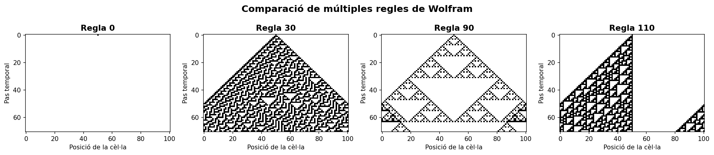
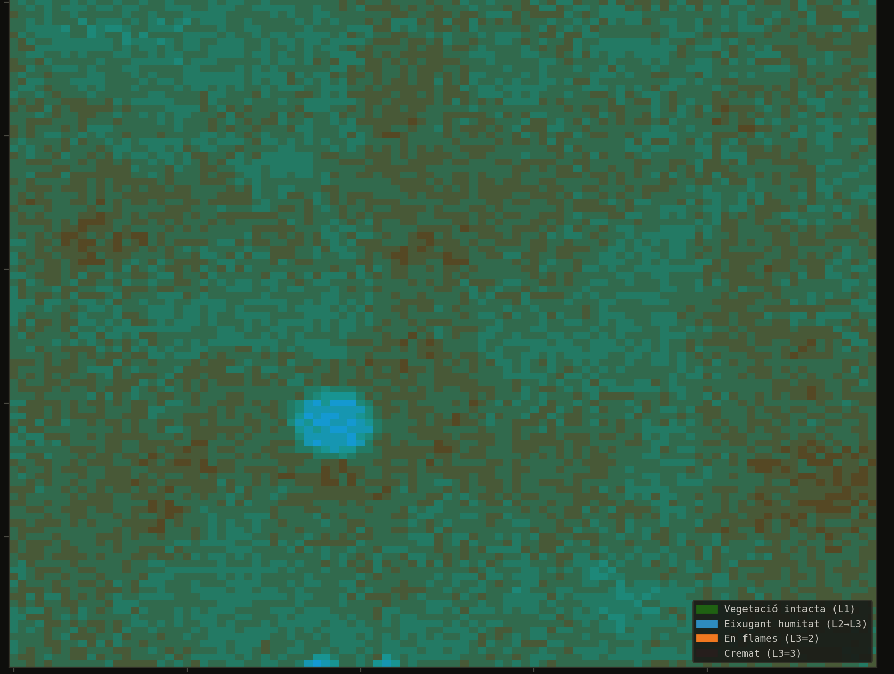
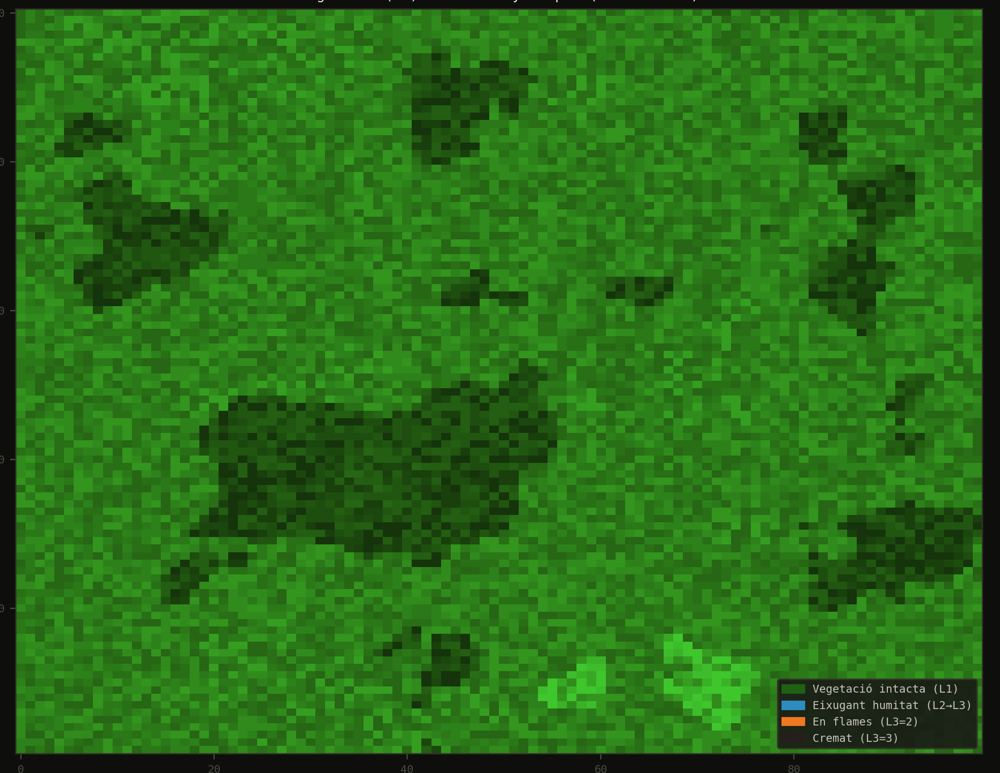

# Simulació d'Autòmats Cel·lulars i Incendis Forestals

Aquest repositori conté el desenvolupament i l'anàlisi de sistemes complexos mitjançant l'ús d'autòmats cel·lulars (CA). El projecte es divideix en dues parts principals: l'estudi teòric d'autòmats cel·lulars unidimensionals de Wolfram (amb tècniques de *coarse-graining*) i el desenvolupament aplicat d'un simulador bidimensional d'incendis forestals multicapa.

Desenvolupat íntegrament en **Python**, fent ús de `numpy` per al processament matricial de dades i `matplotlib` per a la visualització interactiva.

---

## 🛠️ Característiques Principals

### 1. Autòmats Cel·lulars de Wolfram (1D)
* **Simulació de Regles Elementals:** Implementació de les regles 0 (estat absorbent), 30 (caos), 90 (fractals i interferència XOR) i 110 (complexitat i Turing-completesa).
* **Condicions de Contorn Configurables:** Suport per a fronteres periòdiques i fronteres zero.
* **Anàlisi de *Coarse-Graining*:** Reducció de resolució espacial (factor $K=2$) per analitzar la robustesa de les propietats macroscòpiques davant la pèrdua d'informació microscòpica.

### 2. Simulador d'Incendis Forestals (2D multicapa)
* **Model $m:n-CA^k$:** Sistema autòmat cel·lular on la transició d'estat depèn de múltiples capes ambientals interactives:
  * **Capa 1 (Vegetació):** Hores de combustió segons la densitat forestal (des de prats fins a bosc dens).
  * **Capa 2 (Humitat):** Retard d'ignició basat en la proximitat a l'aigua i el relleu.
  * **Capa 3 (Estat del foc):** Transicions entre *Pendent*, *Eixugant*, *Cremant* i *Cremat*.
* **Capa Vectorial de Vent:** Modelització anisotròpica on el vent actua com a vector global (direcció i força), accelerant l'evaporació a sotavent i bloquejant-la a sobrevent.
* **Generació Procedimental de Terreny:** Algorismes integrats per generar patrons naturals (mediterrani, alpí, sabana, costaner) respectant l'orografia, rius i valls.
* **Suport natiu IDRISI:** Lector i intèrpret de fitxers ràster IDRISI32 (`.rst` + `.rdc`) i vectorials IDRISI31 (`.vec` + `.dvc`).
* **Interfície Interactiva:** Visualització dinàmica en temps real amb capacitat per encendre focus d'ignició manualment mitjançant clics a la graella.

---

## 🚀 Instal·lació i Ús

### Prerequisits
El projecte requereix Python 3.x i les següents llibreries:
```bash
pip install numpy matplotlib
```

### Execució del Simulador d'Incendis
El programa es pot executar des de la línia de comandes amb múltiples paràmetres de configuració:

```bash
python incendi_forestal.py \
    [--terrain {mediterranean,alpine,savanna,coastal}] \
    [--veg fitxer.rst --hum fitxer.rst] \
    [--rows N] [--cols M] \
    [--seed S] \
    [--neighborhood {moore,von_neumann}] \
    [--wind fitxer.vec] \
    [--wind-dir GRAUS] \
    [--wind-strength 0.0-1.0]
```

*Nota: També es pot executar directament des d'un entorn de desenvolupament (IDE) com Visual Studio Code executant l'arxiu principal per arrencar amb els paràmetres per defecte.*

---

## 📊 Resultats Destacats

### Anàlisi de Wolfram i *Coarse-Graining*
La primera fase del projecte demostra com petites regles locals (8 bits) generen comportaments globals radicalment diferents. L'aplicació del *coarse-graining* revela que els sistemes purament caòtics (Regla 30) són molt robustos a la pèrdua de detall, mentre que els sistemes computacionalment complexos (Regla 110, els *gliders* de la qual s'esvaeixen en perdre resolució) operen al límit d'escala.


*Evolució espaciotemporal de les regles 0, 30, 90 i 110.*

### Dinàmica de l'Incendi Forestal
El model forestal reacciona a l'orografia d'una manera propera a la realitat. Les zones humides (riberes, valls) actuen com a tallafocs naturals, mentre que els vessants secs cremen ràpidament. L'addició del vent trenca la simetria geomètrica del foc, generant fronts d'avanç parabòlics típics d'un gran incendi.

**Estats del Foc:**
| Valor | Estat | Comportament en la simulació |
|:---:|:---|:---|
| `0` | **Pendent** | Cel·la intacta. S'activa si rep calor veïna. |
| `1` | **Eixugant** | Perd humitat; l'evaporació depèn del vent. |
| `2` | **Cremant** | Consumeix vegetació i propaga calor a l'entorn. |
| `3` | **Cremat** | Cel·la consumida (estat absorbent). |

<p align="center">
  
  &nbsp;
  
</p>
<p align="center"><i>D'esquerra a dreta: Generació procedimental de la capa d'humitat i la capa de vegetació seguint relleus orogràfics realistes.</i></p>

---

## 🤖 Metodologia i Ús de IA

Aquest projecte ha integrat eines d'Intel·ligència Artificial generativa (com Claude) com a suport actiu durant el desenvolupament. La IA s'ha utilitzat per agilitzar la creació de prototips, l'exploració d'algorismes i la resolució eficient de problemes tècnics en la programació. 

De la mateixa manera, ha estat una eina de suport lingüístic en la redacció de la documentació teòrica. Tot el codi i els textos generats han estat revisats, adaptats i validats de forma crítica i exhaustiva per assegurar la correcció tècnica, el rigor acadèmic i la coherència global del sistema, recaient tota la responsabilitat de l'arquitectura del model, el disseny experimental i els resultats finals sobre els autors.
